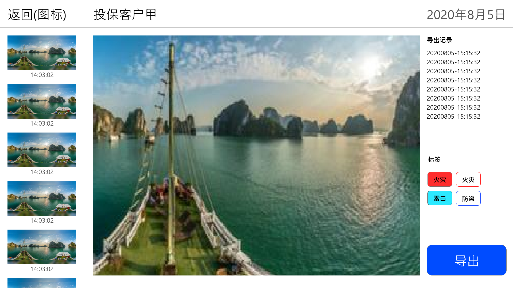

全景照片管理器需求说明书

# 1.概述

全景照片管理器具有以下功能：

* 接收并存储用户从专用终端拍摄的全景照片
* 登录账户
* 显示本账户拍摄的所有全景照片
* 按拍摄时间地点进行分类
* 为一组照片添加名称标签
* 以360度的方式观看全景照片
* 导出特定角度的全景照片

# 2.需求说明

## 2.1 存储系统说明

【021001】专用的拍照终端会将拍好的全景照片自动的上传到本系统的存储服务器中，在上传时通过上传者的账号，标识照片的拍照者、拍照设备，并标记照片的拍摄时间与拍摄地点。本系统需提供上述接口，供照片上传使用。

## 2.2 账户功能

【022001】本系统需提供用户登录与登出功能，使用常规的登陆界面。
【022002】用户的账号附带其姓名、手机号等个人信息。
【022003】登陆后，跳转到全景照片浏览界面

## 2.3 全景照片浏览界面

【023001】顶栏包含用户头像、姓名、退出系统的按钮，其需求如其名。
【023002】当前登陆的用户拍摄的照片按照时间及地点进行分组，显示在浏览照片的区域。
【023003】每一组照片讲有一个组名。组名默认为“未命名客户“，点击“修改名称“，可以修改组名。
【023004】所有分组的组名在左侧边栏显示。点击一个组名，快速跳转到该组照片。
【023005】点击任意全景图，进入全景照片查看界面，并显示该照片。

## 2.4 全景照片查看界面

请忽略示意图中的导出记录于标签。这些功能将会安排在之后的版本里。

【024001】在全景图中拖拽鼠标，改变视角。
【024002】点击导出按钮，讲当前视角的图像保存为png图片。
【024003】顶端菜单栏显示全景图浏览器中的图片所属的小组的名称，拍摄日期以及返回按钮。
【024004】点击返回按钮，回到全景照片浏览界面。
【024005】左侧边栏显示本小组的所有全景图片及拍摄时间。
【024006】点击左侧边栏的图片，将其在全景图查看器中打开。

