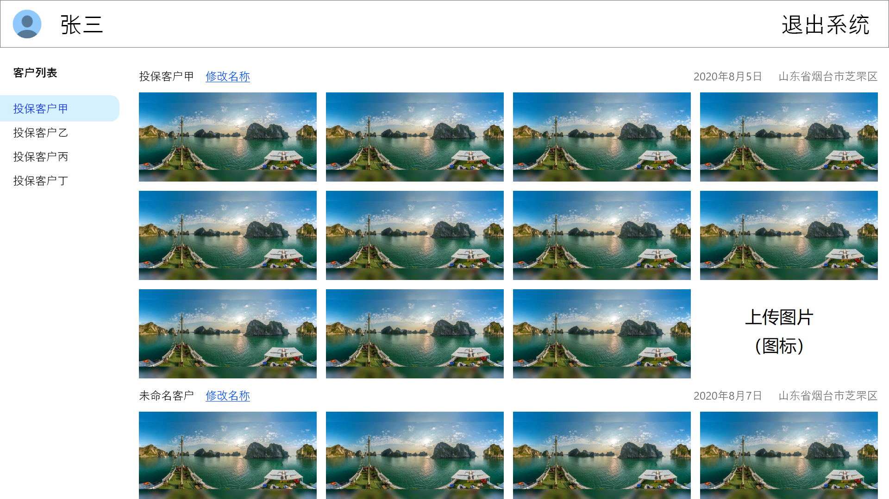

全景照片管理器需求说明书

# 1.概述

全景照片管理器具有以下功能：

* 接收并存储用户从专用终端拍摄的全景照片
* 登录账户
* 显示本账户拍摄的所有全景照片
* 按拍摄时间地点进行分类
* 为一组照片添加名称标签
* 以360度的方式观看全景照片
* 导出特定角度的全景照片

# 2.需求说明

## 2.1 存储系统说明

【021001】专用的拍照终端会将拍好的全景照片自动的上传到本系统的存储服务器中，在上传时通过上传者的账号，标识照片的拍照者、拍照设备，并标记照片的拍摄时间与拍摄地点。本系统需提供上述接口，供照片上传使用。

## 2.2 账户功能

【022001】本系统需提供用户登录与登出功能。

## 2.2 全景照片浏览器

## 2.3 全景照片查看器

